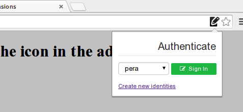
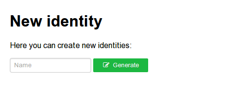

dsauth
======

This is a prototype for a web authentication protocol using [DSA](https://duckduckgo.com/Digital_Signature_Algorithm), i.e. password-less authentication for your website. It's a browser extension / add-on that uses [SJCL](https://github.com/bitwiseshiftleft/sjcl/)'s implementation of ECDSA to sign a challenge and send it to a RESTful web service in your own server. 

Web pages that implement DSAuth must include a special meta tag on their HTML, like this:

```HTML
<meta name="dsap" content="somerandomchallenge">
```

This will trigger the browser extension and it will display an icon in your address bar:



After you select the id you want to use to sign-in, the extension will sign a package with the cryptographyc challenge that looks like this:

```javascript
{
  msg: {
    challenge: "bd273cfe472ab0ad16207e8cb381dadbedfa33d88e5192da3205595748e6174b",
    origin: "http://localhost",
    id: "meow",
    public_key: "9d5e0dc7634ce70f4926a3f09c11235acd170d7cdc454e446e1f925af136d24b2aa74f2bdf0156c6fab09ffe73657cbdab8372060f18dc8962fb5e67c1a59fcc"
  },
  signature: "lbNOwCyoQrB9Lo/0c0MRQXTtTO7M1EPk5+TIQeGBAVdL0xKth+qw2UJeZt/VjYNug2otfoF/ZLWO81r82/x09A=="
}
```

The `public_key` value is only used the first time to register the user in the server's database. After that it will always verify that the `signature` of the stringified JSON `msg` correspond to the public key on the db.

To generate new id's (an username=>keypair) the extension includes this user interface:


